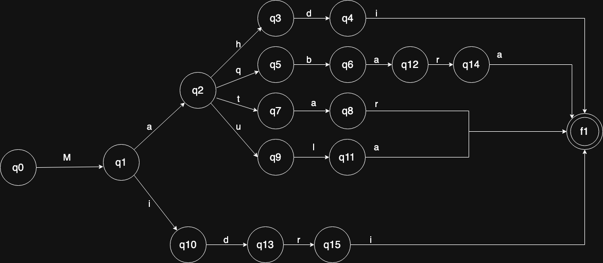

# Evidence 1 Implementation of Lexical Analysis
Ian Hernández Hernández - A01276755

## Description

I chose the 9th set of words that belongs to the Chakobasa language, which is a fictional language used by the Fremen of the Dune Universe created by Frank Herbert. In the series of novels beginning with Dune, it is explained that this language is based on another fictional language, Bhotani Jib.

We'll  be using just 5 words of these language to model and understand the lexical analysis designed to accurately detect a specific language.

1. mahdi - he who is rightly guided
2. maqbara - graveyard (a name for Rossak)
3. matar - a rain of sand from high altitudes
4. maula - slave
5. midri - winnowing fork

We'll be using two approches to the validation and analysis of the language: Finite Automaton and Regulas expressions

## DFA
A Finite Automaton is the simplest way to recognize patterns, there are two types: Deterministic Finite Automaton (DFA) and Non-deterministic Finite Automaton (NFA). Since we are recognizing a finite set of specific words (mahdi, maqbara, matar, maula, midri) and not a more complex pattern language a DFA is the optimal solution both in terms of simplicity and efficiency.

## Regular Expression

